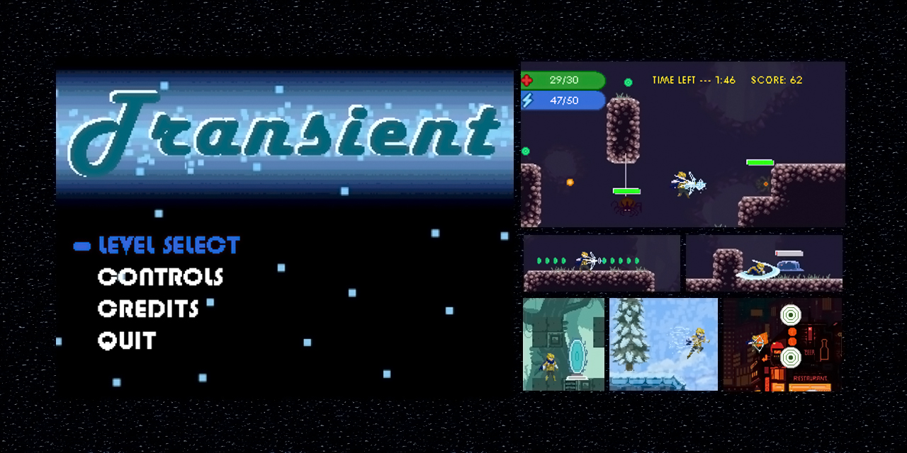

* **Name:** Transient-Game
* **Description:** A 2D platformer game made in Java from scratch, using Graphics2D.
* **Created:** In the months of December 2018 and January 2019
* **Authors:** *Austin Van Braeckel, Sasha Seufert, and Alec Godfrey*
* **Purpose:** *A final assignment for Grade 12 AP Programming*

* __*Author's note: Austin Van Braeckel*__

  This program was created for a final assignment in Grade 12 programming, as a group project. However, while my group members contributed, it was mostly
copying and modifying my existing code, using it as a foundation. The only exception is the functionality related to saves, as my group member, Sasha Seufert
implemented this feature without my assistance. On the other hand, in regards to the other group member, Alec Godfrey, I did pair-programming with him to ensure
that he could comprehend what I had coded already, and therefore still be included in the implementation processs, being able to contribute successful additions to the project. Ultimately, 
both of my group members would agree that the game itself is entirely written by myself. I spent countless hours outside of the time given to us in-class, organizing,
thinking-about, perfecting, debugging, documenting, creating original game-art, and cleaning-up the code of TRANSIENT due to my passion for programming.

* __You can download the distributatble, "*TRANSIENT-DISTRIBUTABLE.zip*," extract the contents to a folder. Then run the "*TRANSIENT.jar*," where it has access to the "*resources*" and "*lib*" folders.

* A known issue is that the game has minor compatibility issues on Mac, and is better suited for Windows-based systems. Also, there may be audio bugs depending on the system on which the game is run.

* __*This project was developed using the NetBeans IDE, and so the .jar executable was built using NetBeans as well.*__

